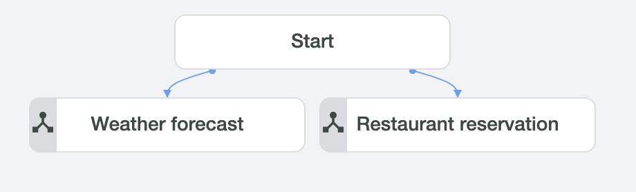
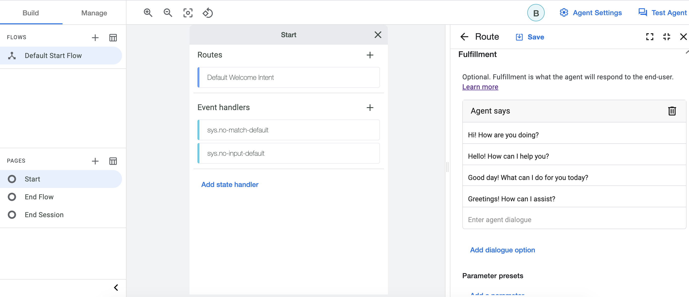
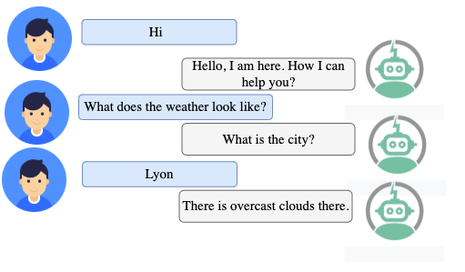
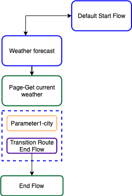
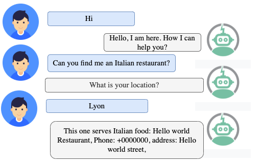
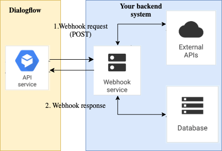
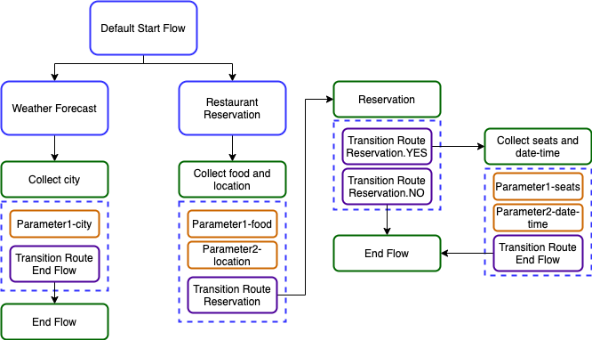
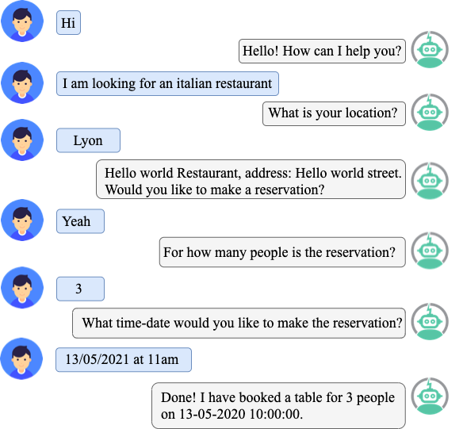
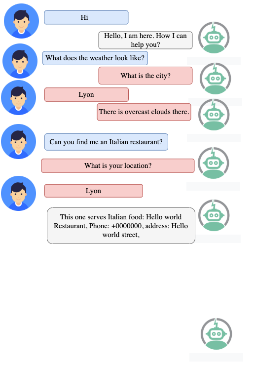

# Dialogflow CX | Tutorial para iniciantes

### Conteúdo
- ##### [Introdução](#intro)
- ##### [Instalação do Ambiente](#install)
- ##### [Configuração do Dialogflow CX](#Setup)
- ##### [Explorando o agente criado](#welcomemessage)
- ##### [Gerenciando Fluxos e Páginas](#FlowsandPages)
- ##### [Exercício](#exercise)
- ##### [Construindo um webhook](#webhook)
- ##### [Desenhando conversas mais complexas](#complexconversations)
- ##### [Conclusão](#conclu)

## <a name="intro"></a>Introdução
Este guia mostra como usar o Console Dialogflow CX para construir e testar um agente de demonstração simples. Ao interagir com este agente, você pode solicitar informações da previsão do tempo, pesquisar um restaurante e fazer uma reserva de mesa. Seu agente completo para este guia será representado pelo console como o seguinte:

<p align="center">
  
</p>

## <a name="install"></a>Instalação do Ambiente
Durante este tutorial, precisaremos usar Python como linguagem de programação, Visual Studio Code para escrever código e Ngrok para implantar serviços de webhook em localhost. [Aqui](https://github.com/hayo03/Installation) estão os passos para instalar todos eles.

## <a name="Setup"></a>Configuração do Dialogflow CX
1. Para usar os serviços fornecidos pelo Google Cloud, você precisa criar um projeto usando o [Google Cloud Console](https://console.cloud.google.com/) e habilitar a API do Dialogflow.
2. Usando o [console DF-CX](https://dialogflow.cloud.google.com/cx/projects), escolha o projeto que você acabou de criar e clique em Criar agente.<br>
3. Complete o formulário para as configurações básicas do agente:<br>
   - Nomeie-o "Demo-agent" <br>
   - Selecione sua localização preferida. <br>
   - Selecione seu fuso horário preferido.<br>
   - Selecione "English" como idioma padrão para seu agente.<br>
4. Clique em Salvar.<br>

## <a name="welcomemessage"></a>Explorando o agente criado
O agente criado tem um Fluxo Inicial padrão com uma página inicial que vem com uma intenção de boas-vindas padrão. Com essa configuração padrão, o agente pode lidar com uma conversa básica com apenas uma mensagem de boas-vindas.



**_Para testar seu novo agente_**:
1. Clique no botão Testar Agente para abrir o simulador.
2. Digite hello na entrada de texto e pressione enter. O agente responde com uma resposta de boas-vindas padrão.
3. Feche o simulador.

**_Para editar a mensagem de resposta de boas-vindas_**:
1. Clique na guia Build.
2. Selecione o Fluxo Inicial Padrão na seção Flows.
3. Clique no nó Start no gráfico. Esta é a página inicial para o Fluxo Inicial Padrão.
4. Encontre a rota de intenção com a Default Welcome Intent e clique nela. Isso abre um painel para editar as informações da rota de intenção.
5. Encontre a seção de fulfillment e exclua todas as mensagens de resposta, então adicione "Olá, estou aqui. Como posso ajudá-lo?" como a única resposta.
6. Clique em Save e feche o painel de edição da rota de intenção.
7. Teste a mensagem de resposta de boas-vindas atualizada.

## <a name="FlowsandPages"></a>Gerenciando Fluxos e Páginas
Até agora, o agente tem um fluxo com a página inicial. Nesta seção, vamos adicionar outro fluxo que lida com solicitações sobre a previsão do tempo. O design deste fluxo é como o seguinte:

<p align="center">
    
</p>

**Fluxo de previsão do tempo:** permite que os usuários perguntem sobre a previsão do tempo em uma determinada cidade. Antes de construí-lo, precisamos criar a intenção que, uma vez correspondida, o fluxo será chamado para lidar com a solicitação do usuário. <br>
**Criar intenção:**
1. Selecione a guia Manage.
2. Clique em Intents, clique em Create, insira weather.current como um nome de intenção e insira as frases de treinamento em [utterances.text](https://github.com/hayo03/Dialogflow-CX-Start-Tutorial/blob/main/intents/GetWeather.txt).
3. Para cada frase que contém uma cidade, anote a cidade com um parâmetro chamado "city" e @sys.geo-city como tipo de entidade e clique em Save.

**Criar Fluxo:**
1. Selecione a guia Build.
2. Clique em Flows.
3. Clique em Create e insira Weather forecast como nome do fluxo.

**Criar Página:** <br>
Por padrão, o fluxo Weather forecast tem uma página especial chamada Start. Quando um fluxo inicialmente se torna ativo, esta página se torna a página ativa atual. Uma página inicial não tem parâmetros ou mensagens de resposta como páginas normais. Portanto, precisamos criar páginas que coletarão informações da cidade do usuário e lidarão com sua solicitação (ou seja, fornecer respostas ao usuário). <br>
1. Clique na página "Start" no fluxo Weather forecast.
2. Clique no botão adicionar + na seção Pages.
3. Insira "Collect city" como um nome de exibição para a página.
4. Clique no botão de configurações more_vert ao lado do nome de exibição da página e selecione Edit.
5. Crie um novo parâmetro:<br>
   - Nome do parâmetro: city<br>
   - Tipo de entidade: @sys.geo-city<br>
   - Marque "Required"<br>
   - Fulfillment (Agent says): Qual é a cidade?<br>

**Criar Rotas:** <br>
Como você notou, não há ligação entre os diferentes fluxos (ou seja, Default Start Flow e Weather forecast Flow) e a página recém-criada (Collect city). Sem esses links, a conversa entre o bot e o usuário não pode ser tratada. Portanto, Rotas são introduzidas para definir tais links. Precisamos definir três rotas como segue:
1. Criar uma Rota que faz a transição do fluxo inicial padrão para o fluxo Weather forecast. Esta rota deve ser chamada quando o usuário final pedir pela previsão do tempo. Para criar esta rota:<br>
   - Selecione o Default Start Flow na seção Flows.
   - Clique no nó Start no gráfico.
   - Adicione a seguinte rota de intenção:
     - Intenção: weather.current
     - Transição: escolha Flow e selecione “Weather forecast” flow
   - Clique em Save

2. Criar uma Rota que faz a transição da página inicial do fluxo Weather forecast para a página "Collect city". Esta rota deve ser chamada quando a intenção “weather.current” for correspondida. Para criar esta rota:<br>
   - Selecione o fluxo “Weather forecast” na seção Flows.
   - Clique no nó Start no gráfico.
   - Adicione a seguinte rota de intenção:
     - Intenção: weather.current
     - Transição: escolha Page e selecione a página “Collect city”
   - Clique em Save

3. Criar uma rota que faz a transição da página “Collect city” para a página End Flow: esta rota deve ser chamada quando todos os parâmetros forem preenchidos. Para criar esta rota:<br>
   - Selecione o fluxo “Weather forecast” na seção Flows.
   - Clique no nó Start no gráfico.
   - Adicione a seguinte rota de intenção:
     - Condição: $page.params.status="FINAL"
     - Fulfillment (O que o Agente responderá ao usuário): Há céu limpo em $session.params.city
     - Transição: escolha Page e selecione a página “End Flow”
   - Clique em Save

Parabéns! Agora você pode testar seu agente para verificar se seu fluxo foi criado corretamente:

**Testar o fluxo Weather forecast:**<br>
1. Clique no botão Test Agent para abrir o simulador.<br>
2. Digite "Como está a previsão do tempo?" e pressione enter.<br>
3. O agente solicitará que você forneça a cidade e então fornecerá a previsão do tempo.<br>

## <a name="exercise"></a>Exercício
Considerando o seguinte exemplo de conversa:
<br clear="left">

1. Identifique o design de fluxo que você acha necessário para suportar o exemplo de conversa dado. Para chegar a uma solução, você pode precisar se perguntar as seguintes perguntas:
   - Preciso adicionar um novo fluxo?
   - Preciso adicionar uma nova intenção? Novos parâmetros? Novos tipos de entidade?
   - Preciso criar uma página?
   - Quais são as rotas necessárias para suportar este caso?
2. Uma vez que você identificou o design necessário, adicione-o ao agente Demo.
3. Teste seu agente Demo para verificar se o que você criou levará ao exemplo de conversa dado.

## <a name="webhook"></a>Construindo um webhook
Neste ponto, o agente criado pode responder aos usuários apenas com mensagens de resposta estáticas. Mas em casos reais, precisamos gerar respostas dinâmicas, validar dados coletados ou acionar ações no back-end. Webhooks são introduzidos para lidar com tudo isso. Eles são simplesmente as partes de back-end do agente.

<p align="center">
  
</p>

Como o diagrama acima mostra, quando um fulfillment que tem um webhook é chamado, a API do Dialogflow envia uma solicitação de webhook para o serviço de webhook. O serviço de webhook recebe a solicitação de webhook e toma quaisquer ações necessárias, como chamar APIs externas, consultar ou atualizar um banco de dados, etc. Ele constrói uma resposta e a envia de volta para a API do Dialogflow. Um webhook pode ser criado em qualquer linguagem de programação do lado do servidor, como Python, PHP ou Node.js. Vamos usar Python para criar um webhook e Ngrok para implantá-lo. Vamos começar a construir nosso webhook para lidar com solicitações de previsão do tempo.

## Criando um serviço de webhook usando Python
Crie uma pasta e nomeie-a como webhook_service. Dentro desta pasta, vamos criar os seguintes dois arquivos: webhook.py, requirements.txt.
- webhook.py: é o serviço de webhook que irá lidar com as solicitações enviadas pelo agente Dialogflow e fornecer uma resposta. Para mantê-lo simples, vamos criar um webhook que obtém parâmetros de uma solicitação do agente e fornece uma resposta estática.

```
#### conjunto mínimo de módulos necessários
import json
from flask import Flask
from flask import Response, request
import requests

### criar e inicializar um aplicativo flask para nosso webhook
app = Flask(__name__)

### Definir uma Rota
@app.route('/my_webhook', methods=['POST'])

### Definir a função que será executada quando a rota associada for chamada

def post_webhook_dialogflow():

#1) Obtendo informações da solicitação do agente dialogflow
    body = request.get_json(silent=True)
    
#Obter tag usada para identificar qual fulfillment está sendo chamado.
    fulfillment = body['fulfillmentInfo']['tag']
    
#Obter parâmetros que são necessários para lidar com a ação desejada
    prameters = []
    for key, value in body['sessionInfo']['parameters'].items():
         prameters.append({'name':key,'value':value})

#2) Executar ação
    msg = invoke_action(fulfillment,  prameters)
    
#3) fornecer uma Resposta de webhook ao Agente do Dialogflow
    WebhookResponse=answer_webhook(msg)
    return WebhookResponse

### Explorar parâmetros e incorporá-los na resposta de texto   
def invoke_action(fulfillment,  prameters):
    print("\n\n\n\n\n=========> CALL ",fulfillment)
    if fulfillment == "GetWeather_fulfillment":
        city=str( prameters[0]['value'])
        msg="Há nuvens encobertas em "+city
        return msg

#### Processa a resposta do webhook que deve seguir um formato JSON particular
def answer_webhook(msg):
    message= {"fulfillment_response": {
      
        "messages": [
        {
          "text": {
            "text": [msg]
          }
        }
      ]
    }
    }
    return Response(json.dumps(message), 200, mimetype='application/json')

### Executar um webhook no localhost
if __name__ == '__main__':
    app.run(host="0.0.0.0", port=8081, debug=True)
```

- requirements.txt: contém as bibliotecas necessárias para criar o serviço de webhook, nomeadamente flask e requests.

```
flask
requests
```

Confira [aqui](https://github.com/hayo03/Dialogflow-CX-Start-Tutorial/blob/main/webhook_service/webhookrequest.json) para o corpo completo da solicitação do webhook. <br> 
Confira [aqui](https://github.com/hayo03/Dialogflow-CX-Start-Tutorial/blob/main/webhook_service/webhookresponse.jsonc) para o corpo completo da resposta do webhook. <br>
Confira [aqui](https://github.com/hayo03/Dialogflow-CX-Start-Tutorial/blob/main/webhook_service/webhook.py) para o script completo do webhook que construímos. <br>

## Executar o serviço de webhook

Abra o terminal, crie um ambiente virtual e instale os pacotes necessários.
 - Sistema operacional: macOS/OS X, Linux; 
```
cd webhook_service
python3 -m venv myenv
source myenv/bin/activate
pip install -r requirements.txt
python webhook.py
```

- Sistema operacional: Windows:

```
cd webhook_service
python3 -m venv myenv
myenv\Scripts\activate.bat
pip install -r requirements.txt
python webhook.py

```
## Implantar um serviço de webhook usando Ngrok

No terminal, basta executar os seguintes comandos:

```
cd Caminho_Para_o_Ngrok
./ngrok http 8081 (ou ngrok http 8081 se o primeiro não funcionar)

```

## Configurar webhook no Dialogflow e testá-lo

Precisamos primeiro criar um webhook e adicioná-lo ao fulfillment na página "Collect city":
1. Criar webhook 
   - Selecione a guia Manage.
   - Clique em Webhooks, Clique em Create e coloque "my_webhook_service" como display name.
   - Insira a URL do seu webhook gerada pelo ngrok, algo como https://2f4168d1c17d.ngrok.io/my_webhook.
   - Clique em Save.
2. Adicionar um webhook a um fulfillment
   - Clique na página "Collect city"
   - Clique na rota existente
   - Encontre a seção de fulfillment e marque "Use Webhook"
   - Selecione "my_webhook_service" e insira "GetWeather_fulfillment" no campo tag.
3. Para testar o webhook, clique em Test Agent e insira "Como está a previsão do tempo?". Se tudo estiver bem configurado, o agente deverá fornecer a resposta de texto que você forneceu.

#### Atualizar o webhook para invocar um serviço externo

Neste ponto, nosso webhook só pode obter informações e invocar uma ação simples que fornece uma resposta estática sobre as condições climáticas. Mas em casos reais, precisamos invocar um dos serviços externos, como a conhecida [API Open Weather](https://openweathermap.org/api) para obter informações meteorológicas em tempo real. Para fazer isso, precisamos atualizar a função invoke_action para ser capaz de chamar a API Open Weather:

```
def invoke_action(fulfillment, prameters):
    print("\n\n\n\n\n=========> CALL API ",fulfillment)
    if fulfillment == "GetWeather_fulfillment":
        for prameter in prameters:
             if prameter['name']=="city":
                 city=str(prameter['value'])
        appid="25e5d7b2fff948d0749a8b9e9e14f5f9"
        url = 'http://api.openweathermap.org/data/2.5/weather?q='+city+'&appid='+appid
        result = requests.get(url)
        jsonResult = result.json()
        if result.status_code == 200:
            weatherCondition = jsonResult['weather'][0]['description']
            reply = "Há {} lá.".format(weatherCondition)
            print(reply)
            return reply
        else:
            return "Algo deu errado com a API."
```

- Teste o webhook atualizado para verificar se ele se comporta corretamente.

## <a name="complexconversations"></a>Desenhando conversas mais complexas
- ##### [Lidando com múltiplas intenções](#multipleintents)
- ##### [Reutilizando informações entre fluxos](#reuseinformation)

## <a name="multipleintents"></a>Lidando com múltiplas intenções
Anteriormente, criamos dois fluxos simples (ou seja, previsão do tempo e reserva de restaurante). Nesta parte, mostramos como projetar um fluxo para permitir que o bot escolha diferentes rotas dependendo da intenção do usuário. Vamos estender o fluxo "reserva de restaurante" para permitir que o usuário faça uma reserva se ele quiser, ou o bot se despeça do usuário se ele não quiser fazer uma reserva. Para suportar este cenário, precisamos criar duas novas intenções "Reservation.YES" e "Reservation.NO".
<p align="center">
 
 
</p>

1. Crie as intenções "Reservation.YES" e "Reservation.NO".
2. Selecione o fluxo "Reserva de restaurante" e adicione estas duas páginas:
   - Nome da página: "Reservation"
   - Nome da página: "Collect seats and date-time" / Adicione os dois parâmetros "seats" e "date-time". Para o parâmetro "seats" o agente pergunta "Para quantas pessoas você gostaria de fazer a reserva?" e para o parâmetro "date-time" o agente pergunta "Para qual data-hora você gostaria de fazer a reserva?".
3. Atualize a rota de "Collect food and location" para a página "End Flow".
   - Altere a página "End Flow" para a página "Reservation".
   - Adicione à seção Fulfillment o texto "Você gostaria de fazer uma reserva?".
4. Adicione duas rotas à página "Reservation".
   - Rota 1: Coloque a intenção como "Reservation.NO", Fulfillment como "Venha nos visitar novamente quando estiver com fome! Tchau 👋", e transição para a página "End Flow".
   - Rota 2: Coloque a intenção como "Reservation.YES" e transição para a página "Collect seats and date-time".
5. Adicione uma rota à página "Collect seats and date-time".
   - Coloque a condição como $page.params.status="FINAL", Fulfillment como "Pronto! Eu reservei uma mesa para $session.params.seats pessoas em $session.params.date-time.", e transição para a página "End Flow".
      
## <a name="reuseinformation"></a>Reutilizando informações entre fluxos
Depois de completar ambos os fluxos, o agente será capaz de lidar com solicitações dos usuários sobre previsão do tempo e reserva de restaurante. No entanto, quando você interage com o agente, notará que ele pode pedir informações que você já forneceu. Como mostrado abaixo, o agente pergunta ao usuário "qual é a sua localização" apesar de o usuário já ter fornecido sua cidade em um dos turnos anteriores. <br>

<p align="center">
  
</p>

Para evitar tal problema, o agente precisa explorar bem o contexto, ou seja, qualquer informação que possa ser aproveitada das voltas anteriores da conversa ou de quaisquer outras fontes (por exemplo, perfil do usuário). Neste tutorial, estamos interessados em explorar as voltas anteriores da conversa como a principal fonte para o contexto. De fato, no Dialogflow CX, existe um recurso interessante chamado **Predefinição de Parâmetro (na seção Fulfillment)** que permite definir ou substituir os valores dos parâmetros. Então, vamos explorar este recurso para reutilizar informações dos parâmetros de sessão que representam os parâmetros preenchidos nos turnos anteriores. Para fazer isso: <br>
1. Selecione a página “Collect city” no fluxo Weather forecast e edite a rota já definida.
2. Encontre o recurso Predefinição de Parâmetro dentro da seção Fulfillment.
3. Clique em Add Parameter e adicione o seguinte:
   - Parâmetro: location; 
   - Valor: "$session.params.city" 
4. Teste novamente o agente, o que você percebe? 
5. (Exercício) Agora, o que precisamos fazer para que o agente seja capaz de reutilizar o valor de location no fluxo Search restaurant para o parâmetro city no fluxo Weather forecast? 

## <a name="conclu"></a>Conclusão
Até agora, exploramos como:
  - Configurar um projeto DF CX
  - Criar um agente.
  - Criar intenções, parâmetros e tipos de entidade.
  - Criar fluxos, páginas e construir links entre eles usando rotas
  - Criar um webhook e fazer chamadas para um serviço externo
  - Desenhar conversas mais complexas

Há outros recursos interessantes do agente que não abordamos, incluindo integrações, manipuladores de eventos e muito mais. No geral, este tutorial cobre a maioria dos conceitos básicos do Dialogflow CX que todo desenvolvedor de bots deve dominar para construir agentes conversacionais dotados de capacidades avançadas.

**_Por favor, envie seu feedback para brabra.hayeet@gmail.com_**
